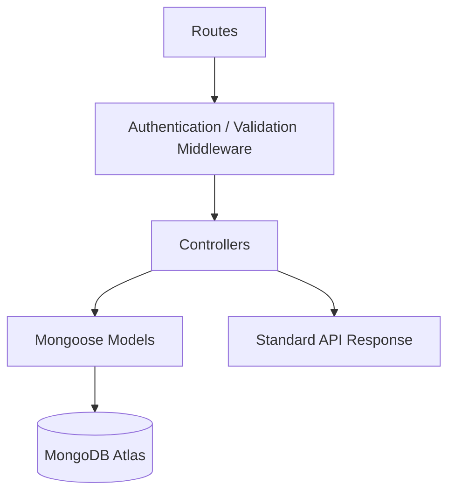
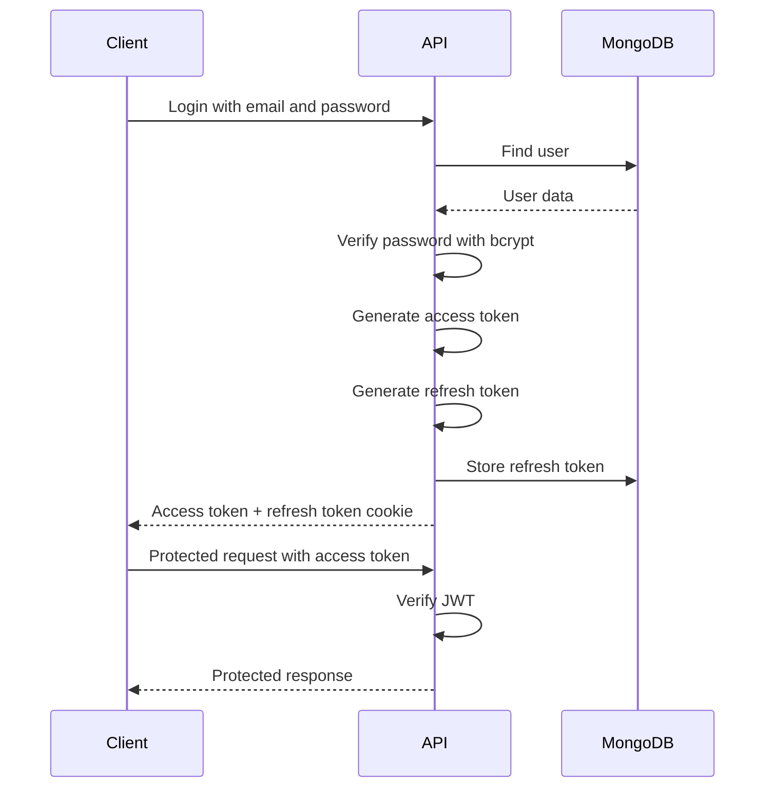
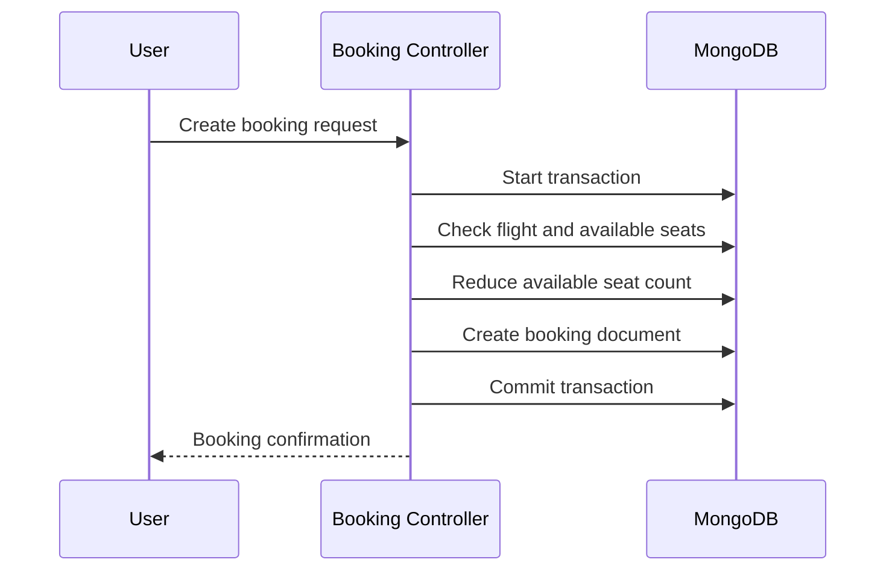

# SkyWay Backend API

The SkyWay backend is a REST API built using Node.js, Express.js, MongoDB, and Mongoose. It manages authentication, users, flights, bookings, admin operations, validation, and secure token handling.

## Responsibilities

The backend is responsible for:

- User registration and login
- Password hashing using bcrypt
- JWT access-token generation
- Refresh-token storage and rotation
- Role-based authorization
- Flight creation, updates, search, and deletion
- Booking creation and cancellation
- Seat availability management
- Admin dashboard statistics
- Request validation and centralized error handling

## Backend Tech Stack

| Technology | Purpose |
|---|---|
| Node.js | Runtime environment |
| Express.js | REST API framework |
| MongoDB Atlas | Cloud database |
| Mongoose | MongoDB ODM |
| JWT | Authentication |
| bcryptjs | Password hashing |
| express-validator | Request validation |
| Helmet | Security headers |
| CORS | Cross-origin request handling |
| Morgan | HTTP request logging |

## Folder Structure

```text
Backend/
│
├── src/
│   ├── config/          # Database and environment configuration
│   ├── controllers/     # Request handling logic
│   ├── middlewares/     # Auth, validation, errors, rate limiting
│   ├── models/          # Mongoose schemas
│   ├── routes/          # API route definitions
│   ├── utils/           # JWT, API response, helpers
│   ├── validators/      # Input validation rules
│   ├── app.js           # Express app configuration
│   └── server.js        # Server entry point
│
├── seeder.js            # Demo-data seeder
├── package.json
└── README.md
```

## Backend Architecture



## Authentication Flow

SkyWay uses short-lived access tokens and longer-lived refresh tokens.



## Token Strategy

| Token | Storage | Purpose |
|---|---|---|
| Access Token | Frontend memory / Redux state | Used for authenticated API requests |
| Refresh Token | HTTP-only cookie + database | Used to generate a new access token |

## Booking Consistency Flow

Booking creation uses database transactions to reduce the chance of inconsistent seat availability.



If a booking operation fails, the transaction is rolled back so that seats are not incorrectly deducted.

## API Modules

| Module | Description |
|---|---|
| Auth | Register, login, logout, refresh token |
| Users | Profile and account management |
| Flights | Search, view, create, update, delete flights |
| Bookings | Create, view, cancel bookings |
| Admin | Dashboard statistics, booking management, flight management |

## Environment Variables

Create a `.env` file inside the `Backend` directory.

```env
PORT=3000
NODE_ENV=development

MONGODB_URI=your_mongodb_connection_string

JWT_ACCESS_SECRET=your_access_secret
JWT_REFRESH_SECRET=your_refresh_secret

ACCESS_TOKEN_EXPIRY=15m
REFRESH_TOKEN_EXPIRY=7d

CLIENT_URL=http://localhost:5173
```

## Installation

```bash
cd Backend
npm install
```

## Run Locally

### Development mode

```bash
npm run dev
```

### Production mode

```bash
npm start
```

## Seed Demo Data

```bash
npm run seed
```

This can populate the database with sample users, admin credentials, flights, and bookings.

## Security Practices

- Passwords are hashed using bcrypt
- JWT-protected routes require authorization middleware
- Refresh tokens are stored separately from access tokens
- Role-based authorization protects admin routes
- Request validation is applied using express-validator
- Helmet adds common security headers
- CORS restricts allowed frontend origins
- Rate limiting helps reduce abuse
- Centralized error middleware prevents raw server errors from leaking

## Deployment

The backend is deployed on Render and connects to MongoDB Atlas.

Before deployment, ensure:

- `NODE_ENV=production`
- `CLIENT_URL` is set to the deployed frontend URL
- MongoDB Atlas network access allows the deployment server
- JWT secrets are configured securely in Render environment variables