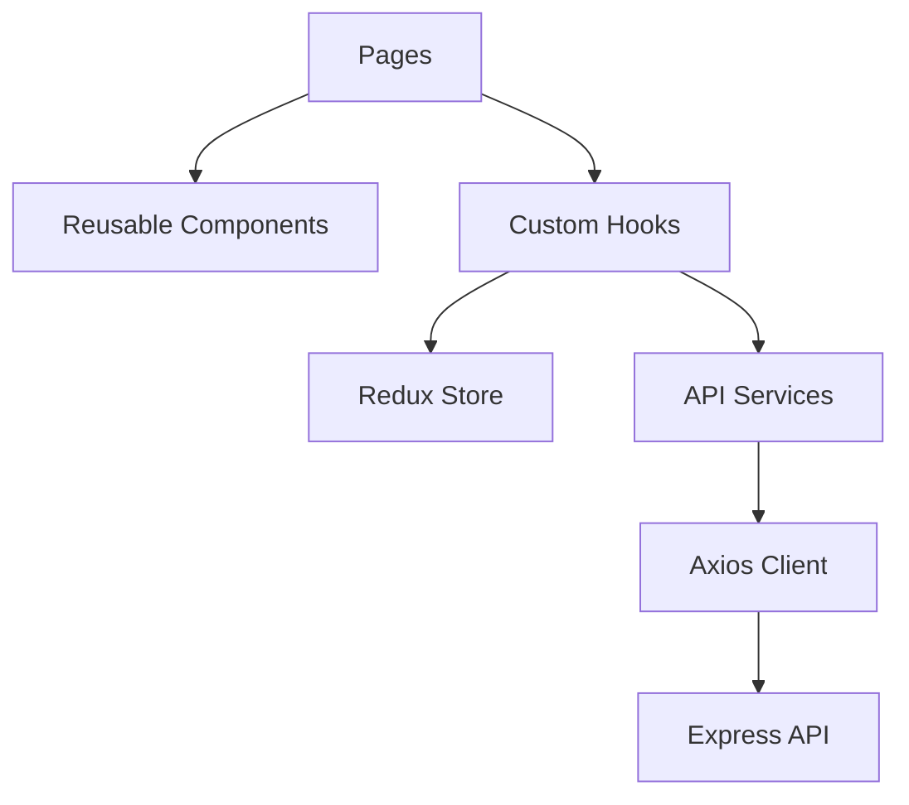
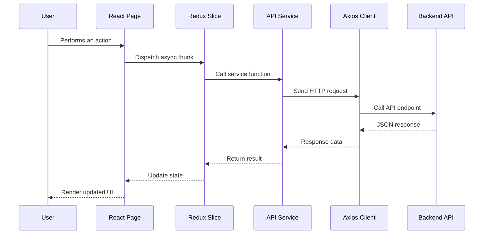
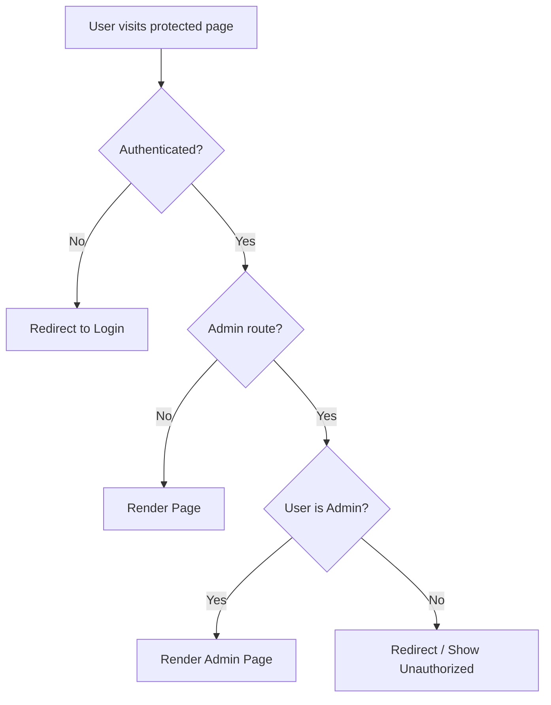

# SkyWay Frontend

The SkyWay frontend is a responsive React application built with Vite and Tailwind CSS. It provides the user interface for flight search, booking, authentication, profile management, and admin operations.

## Responsibilities

The frontend is responsible for:

- Rendering the flight booking interface
- Managing authentication state
- Sending API requests to the backend
- Protecting authenticated routes
- Protecting admin-only routes
- Managing flights, bookings, and profile state
- Displaying loading, error, and success states
- Supporting dark and light themes

## Frontend Tech Stack

| Technology | Purpose |
|---|---|
| React | UI library |
| Vite | Development server and build tool |
| Tailwind CSS | Styling |
| Redux Toolkit | Global state management |
| React Router | Client-side routing |
| Axios | HTTP requests |
| Framer Motion | UI animations |
| React Query | Server-state support |

## Folder Structure

```text
Frontend/
│
├── src/
│   ├── components/       # Reusable UI components
│   ├── pages/            # Page-level components
│   ├── layouts/          # Public and dashboard layouts
│   ├── routes/           # Route configuration
│   ├── services/         # API service functions
│   ├── store/            # Redux store and slices
│   ├── hooks/            # Custom React hooks
│   ├── context/          # Theme context
│   ├── utils/            # Utility functions
│   ├── App.jsx
│   └── main.jsx
│
├── public/
├── package.json
└── README.md
```

## Frontend Architecture



## Redux and API Request Flow



## Protected Route Flow



## Main Pages

### Public Pages
- Landing page
- Login page
- Register page
- Flight search page
- Flight results page
- Flight details page

### User Pages
- Booking flow
- Booking success page
- My bookings
- Profile page

