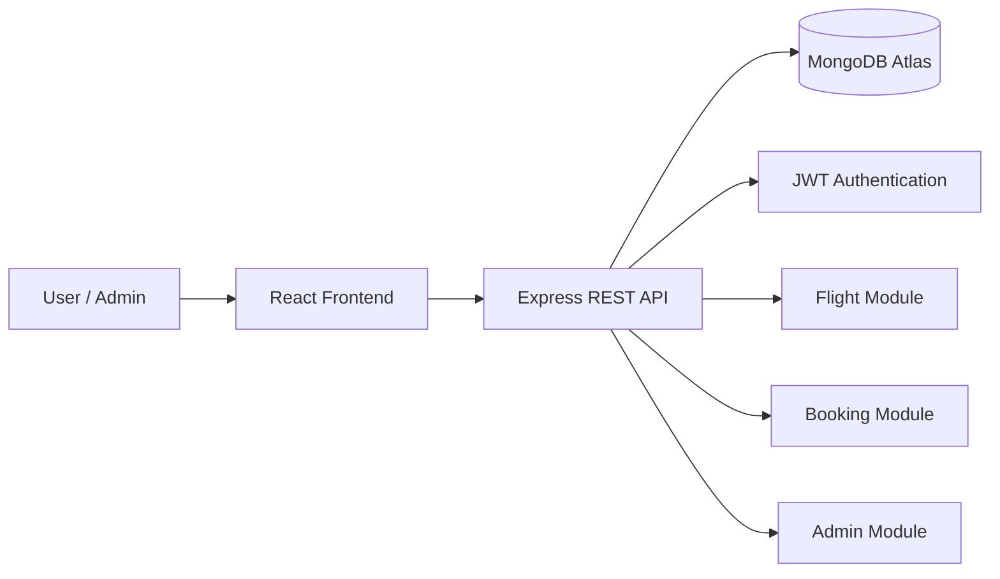
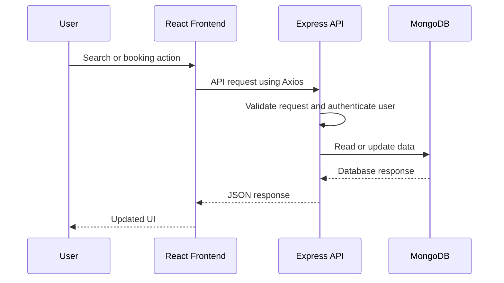
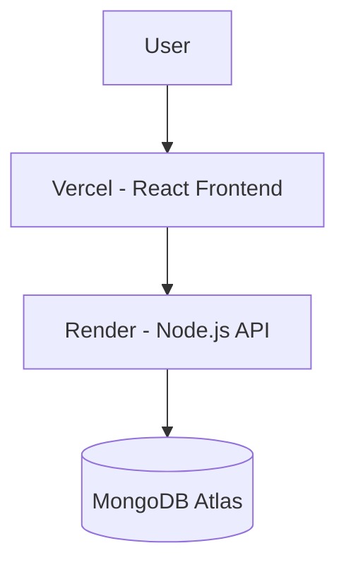

# SkyWay — Flight Booking Platform

SkyWay is a full-stack flight booking platform built with the MERN stack. It allows users to search flights, create bookings, manage their profile and bookings, while administrators can manage flights, bookings, and dashboard insights.

## Live Demo

- **Frontend:** [https://sky-way-swart.vercel.app](https://sky-way-swart.vercel.app)
- **Backend API:** [https://skyway-api-nl2z.onrender.com](https://skyway-api-nl2z.onrender.com)

## Project Overview

SkyWay is split into two independent applications:

- **Frontend** — React client for users and administrators
- **Backend** — Node.js REST API responsible for authentication, flights, bookings, validation, and database operations

For detailed setup and architecture of each application:

- [Backend Documentation](./Backend/README.md)
- [Frontend Documentation](./Frontend/README.md)

## Key Features

### User Features

- Register and log in securely
- Search flights by origin, destination, date, passengers, and cabin class
- View flight details and availability
- Create bookings
- View booking history
- Cancel eligible bookings
- Update profile details
- Dark/light theme support

### Admin Features

- Dashboard analytics
- Add, edit, and manage flights
- Manage user bookings
- View booking and revenue statistics
- Role-based protected routes

## Tech Stack

| Layer | Technologies |
|---|---|
| Frontend | React, Vite, Tailwind CSS, Redux Toolkit, React Router, Axios |
| Backend | Node.js, Express.js, MongoDB, Mongoose |
| Authentication | JWT access tokens, refresh tokens, bcrypt |
| Deployment | Vercel, Render, MongoDB Atlas |

## System Architecture



## End-to-End Request Flow



## Deployment Architecture



## Local Setup

### 1. Clone the repository

```bash
git clone <your-repository-url>
cd SkyWay
```

### 2. Start the backend

```bash
cd Backend
npm install
npm run dev
```

### 3. Start the frontend

Open another terminal:

```bash
cd Frontend
npm install
npm run dev
```

The frontend will run locally and communicate with the backend API using the configured environment variable.

## Repository Structure

```bash
SkyWay/
│
├── Backend/          # Node.js + Express REST API
├── Frontend/         # React + Vite client application
├── README.md         # Project-level documentation
└── .gitignore
```

## Documentation Map

| Documentation | Contains |
|---|---|
| Root README | Overall project architecture, setup order, deployment overview |
| Backend README | API, database models, authentication, booking transaction flow |
| Frontend README | React architecture, Redux state management, route protection, UI setup |

## Author

**Amber Hasan**